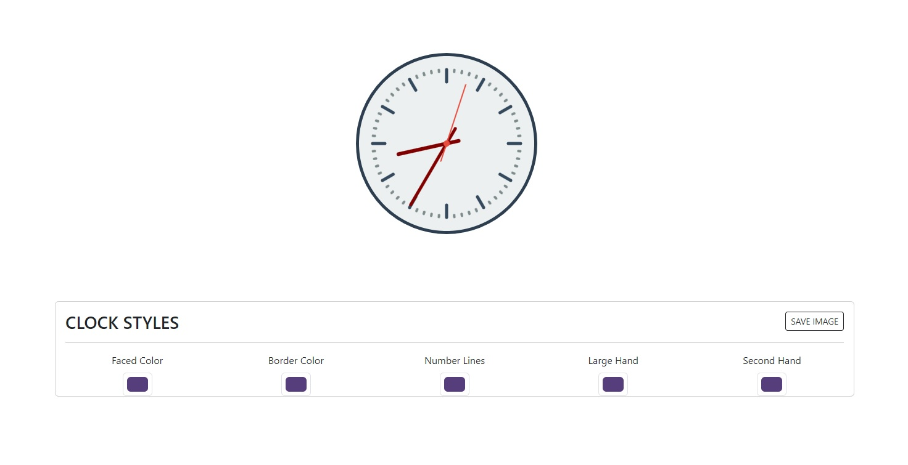

<div align="center">
  
  <h1>Anderson Toledo Martins Moreira</h1>
  <h4>
    Frontend Software Engineer <br />
    <a href="http://www.atmm.dev" target="_blank">Resume Online</a>
  </h4>
</div>
<br >
<!-- References for Create budgets :: https://shields.io/category/build -->
<div align="center">
  
  
  
  
</div>

<br >

## Description
This is a project to improve my skills with Javascript Vanilla with canvas, follow the tutorial from Brad Traversy.

## Screens Layout
<div align="center">
  Layout <br><br>
  
</div>

<br >

## Programming Languages and Frameworks.
```bash
# HTML5 / CSS3
# Javascript
# Git / Github
# Canvas
```

<br >

## System Requirements
```bash
# Git
# Node
```

<br >

## Getting Started With Local Development Configuration

```bash
# Download or clone the repository.
# Open the project inside your favorite IDE (I use VSCode).
# If you have the extension `Live Server` installed in VSCode.
# Click on the file index.html with right button in yor mouse, and select `Open with Live server`
# If NOT, you just open the file index.html in your favorite browser.
```
